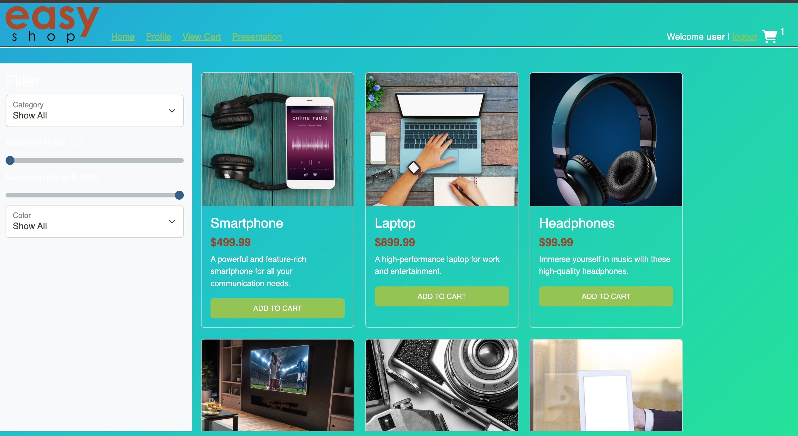
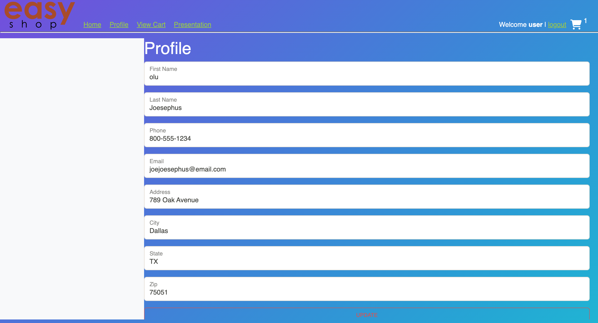
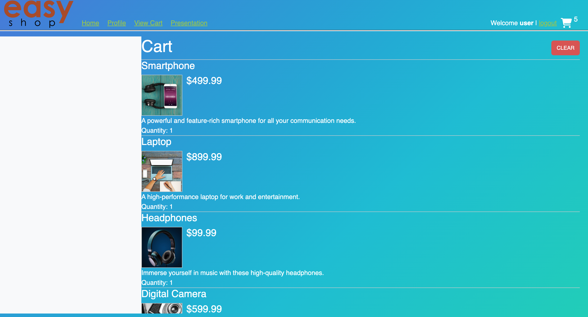

# EasyShop

A Java-based e-commerce application for managing products, customers, and orders with a focus on simplicity and scalability.

---

## 📚 Table of Contents

- [About](#about)
- [Features](#features)
- [Architecture](#architecture)
- [Technologies](#technologies)
- [Getting Started](#getting-started)
    - [Prerequisites](#prerequisites)
    - [Installation](#installation)
    - [Running the Application](#running-the-application)
    - [Configuration](#configuration)
- [Usage Guide](#usage-guide)
    - [Product Management](#product-management)
    - [Customer Management](#customer-management)
    - [Order Management](#order-management)
- [Testing](#testing)
- [Running the Live Server & Using Developer Tools](#running-the-live-server--using-developer-tools)
- [Contributing](#contributing)
- [License](#license)

---

## About

EasyShop is designed as an educational and practical Java console application simulating an online shopping system. It demonstrates CRUD operations, object-oriented design, data management, and testing best practices.

---

## Features

<details>
  <summary><strong>Click to expand Features</strong></summary>

- Manage products: add, update, delete, list.
- Manage customers: register, update details, view.
- Create and process orders.
- Console-based interface for interaction.
- Modular and extensible architecture.
- Unit-tested core functionality.

</details>

---

## Architecture

<details>
  <summary><strong>Click to expand Architecture Overview</strong></summary>

- **Main Layers**
    - **Presentation**: Console-based UI
    - **Service**: Business logic
    - **Data Access (DAO)**: CRUD operations
    - **Model**: Java classes representing domain entities

- **Design Principles**
    - Separation of Concerns (SoC)
    - Dependency Injection (DI-ready)
    - Interface-based design for easy testing

</details>

---

## Technologies

- Java 17+
- JUnit 5 and Mockito for testing
- Maven for build automation
- MySQL Database for the persistence layer

---

## Getting Started

### Prerequisites

- Java 17+
- Maven
- Git
- MySQL Community Server + MySQL Workbench
    - [MySQL Download Guide](https://dev.mysql.com/downloads/mysql/)
- IntelliJ IDEA Community Edition or your preferred IDE
    - [IntelliJ IDEA Download](https://www.jetbrains.com/idea/download/)
- Postman (for API testing)
    - [Postman Download](https://www.postman.com/downloads/)

### Installation

1. **Clone the repository**:
    ```bash
    git clone your-link-here
    cd easyshop
    ```

2. **Configure the Database**
    - Start your MySQL server.
    - Create a new database, for example:
      ```sql
      CREATE DATABASE easyshop_db;
      ```
    - Update database connection details in:
      ```
      src/main/resources/application.properties
      ```
      Example:
      ```
      db.url=jdbc:mysql://localhost:3306/easyshop_db
      db.username=root
      db.password=yourpassword
      ```

3. **Build the Project**:
    ```bash
    mvn clean install
    ```

4. **Run the Application**:
    ```bash
    mvn exec:java -Dexec.mainClass="com.easyshop.Main"
    ```

5. **Test the Application**:
    - Use Postman to interact with your APIs or directly use the console interface.
    - Import the prepared Postman collection for quick testing:
        - [EasyShop Postman Collection](./postman/EasyShop.postman_collection.json)

6. **Running Unit Tests**
    - This project includes JUnit tests covering key functionality like services and DAOs.
    - Run all tests with Maven:
      ```bash
      mvn test
      ```
    - Browse the test source files here:
        - [Unit Tests Folder](./src/test/java)

---

## Running the Live Server & Using Developer Tools

To preview the frontend of EasyShop with live updates:

1. **Install Live Server**
    - If you’re using **Visual Studio Code**, install the “Live Server” extension from the Extensions marketplace.

2. **Start the Live Server**
    - Open your project folder in VS Code.
    - Right-click on `index.html` (or your main HTML file) and select **Open with Live Server**.
    - Your browser should open automatically at [http://127.0.0.1:5500](http://127.0.0.1:5500) or [http://localhost:5500](http://localhost:5500).
    - Any changes to your HTML, CSS, or JavaScript will refresh the page automatically.

3. **Using Developer Tools**
    - Open your browser’s Developer Tools:
        - **Chrome/Edge**: `Ctrl+Shift+I` (Windows/Linux) or `Cmd+Option+I` (Mac).
    - Key tabs for debugging:
        - **Elements**: Inspect and modify HTML/CSS.
        - **Console**: View logs and error messages.
        - **Network**: Monitor API requests and responses.
        - **Sources**: Set breakpoints and debug JavaScript.

---

**Note:**
- For detailed installation steps on each tool (Java, IntelliJ, Git, MySQL, Postman), refer to your Year Up Software Installation Guide or the official documentation linked above.
- For a consistent development experience, it’s recommended to use **Google Chrome** as your browser.

---

## Contributing

Contributions are welcome! Please:

1. Fork the repository.
2. Create a new branch:
    ```bash
    git checkout -b feature/your-feature-name
    ```
3. Commit your changes:
    ```bash
    git commit -m "Add new feature"
    ```
4. Push your branch:
    ```bash
    git push origin feature/your-feature-name
    ```
5. Open a Pull Request.

---

## Quick Links

- **Frontend Folder**  
  Quickly access the frontend files (HTML, CSS, JS) for EasyShop:  
  [Frontend Folder](./frontend)

- **Database Folder**  
  Access database scripts, migrations, or SQL setup files here:  
  [Database Folder](./database)
    - For example, use the SQL script provided to set up your database tables before running the application.

---

## Running the Backend

To start the backend manually in your IDE:

1. Open the `src` folder in your IDE (e.g., IntelliJ IDEA).
2. Locate and run the `Main` class:

---

## Usage Guide

<details>
  <summary><strong>Product Management</strong></summary>

- Add Product
- Update Product
- Delete Product
- List Products

</details>

<details>
  <summary><strong>Customer Management</strong></summary>

- Register new customer
- Update customer info
- View customer list

</details>

<details>
  <summary><strong>Order Management</strong></summary>

- Create new order
- View order history
- Update order status

</details>

---
## Screenshots

Here’s a preview of the EasyShop homepage and key features:

### 🏠 Homepage with Product Categories, Search, and Filters

- Displays all product categories clearly, making it easy for users to browse and find items.
- Interactive search bar and filters let users quickly find products by name, category, or price.



### 👤 Profile Management

- Profile section: update or create your user profile, keeping customer details current.



### 🛒 Shopping Cart

- Cart feature: add items, view cart details, and proceed to checkout seamlessly.



---

## Highlighted Code

One of the most interesting parts of working on EasyShop was learning and implementing **Mockito** for unit testing. This code snippet might not seem mind-blowing, but it represents my curiosity to learn and my commitment to writing safe, maintainable code. Writing tests like this helped me understand mocking, verifying behavior, and building confidence in my application logic.

I learned Mockito by practicing with tutorials and watching a course on LinkedIn Learning:  
[Introduction to TDD in Spring Boot (LinkedIn Learning)](https://www.linkedin.com/learning/test-driven-development-in-spring-boot-with-junit-and-mockito/introduction-to-tdd-in-spring-boot).

Here’s the example test method I wrote:

```java
@Test
public void getAllCategoriesTest() {
    List<Category> expectedCategoryList = new ArrayList<>();
    expectedCategoryList.add(new Category(1, "charger", "A phone charger"));
    expectedCategoryList.add(new Category(2, "iphone", "An iPhone"));

    // Arrange
    when(categoryDao.getAllCategories()).thenReturn(expectedCategoryList);

    // Act
    List<Category> categoryList = controller.getAll();

    // Assert
    assertThat(categoryList)
        .isNotEmpty()
        .isEqualTo(expectedCategoryList)
        .hasSize(2);
}
```
---

## License

No License at this time 
